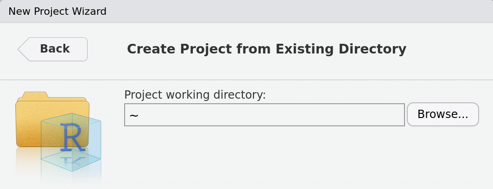

```{r setup, include=FALSE}
options(htmltools.dir.version = FALSE)
knitr::opts_chunk$set(
  fig.width=9, fig.height=3.5, fig.retina=3,
  out.width = "100%",
  cache = FALSE,
  echo = TRUE,
  message = FALSE, 
  warning = FALSE,
  hiline = TRUE
)
```

```{r xaringan-themer, include=FALSE, warning=FALSE}
library(xaringanthemer)

style_duo_accent(
  primary_color = "#2f4871",
  secondary_color = "#2e91af",
  inverse_header_color = "#FFFFFF",
  header_color = "#106075",
  background_color = "#e9ebee",
  header_font_google = google_font("Oswald", "700", "700i"),
  text_font_google = google_font("Spartan", "400", "400i",
                                 "700", "700i"),
  code_font_google = google_font("Fira Code", "400",
                                 "700"),
  outfile = "xaringan-lis.css"
)
```

```{r xaringan-tile-view, echo=FALSE}
xaringanExtra::use_tile_view()
```

```{r broadcast, echo=FALSE}
xaringanExtra::use_broadcast()
```

```{r xaringan-scribble, echo=FALSE}
xaringanExtra::use_scribble()
```

```{r xaringan-panelset, echo=FALSE}
xaringanExtra::use_panelset()
```

```{r xaringanExtra-clipboard, echo=FALSE}
htmltools::tagList(
  xaringanExtra::use_clipboard(
    button_text = "<i class=\"fa fa-clipboard\"></i>",
    success_text = "<i class=\"fa fa-check\" style=\"color: #90BE6D\"></i>",
    error_text = "<i class=\"fa fa-times-circle\" style=\"color: #F94144\"></i>"
  ),
  rmarkdown::html_dependency_font_awesome()
)
```

```{r xaringan-logo, echo=FALSE}
xaringanExtra::use_logo(
  image_url = "img/InnovaLab_logo_blue.png",
  width = "100px",
  height = "116px"
)
```

```{r xaringan-extra-styles, echo=FALSE}
xaringanExtra::use_extra_styles(
  hover_code_line = TRUE,         
  mute_unhighlighted_code = TRUE  
)
```

```{r xaringanExtra, echo = FALSE}
xaringanExtra::use_progress_bar(color = "#0051BA",
                                location = "bottom")
```

## Acerca del curso

---
name: colors

## Exploración competencial

---

## ¿Qué es Ciencia de Datos?

.pull-left[.line-space2-5[.font120[
La Ciencia de Datos es una fusión entre múltiples disciplinas, incluyendo matematicas, estadistica, informatica, y tecnologia de la información. 

La Ciencia de Datos permite extraer información relevante de los datos.
]]]

.pull-right[
```{r echo=FALSE, out.width="90%", fig.align='center'}
knitr::include_graphics("img/ciencia_datos_1.png")
```
]

---

## ¿Por qué usar R para Ciencia de Datos?

.line-space2-5[.font120[
R cuenta con las herramientas necesarias (entorno, librerías, y funciones) para desarrollar proyectos de Ciencia de Datos.
]]

```{r echo=FALSE, out.width="90%", fig.align='center'}
knitr::include_graphics("img/ciencia_datos_2.png")
```

---

## Reconocimiento Rstudio


---

## ¿Por qué utilizar proyectos?

---

## Creación de proyectos

.pull-left[
**PASOS:**

1. Seleccionamos “Project (None)” o  “File” y  luego, new project.

```{r echo=FALSE, out.width="100%", fig.align='center'}
knitr::include_graphics("img/creacion_proyectos_1.png")
```

```{r echo=FALSE, out.width="100%", fig.align='center'}
knitr::include_graphics("img/creacion_proyectos_2.png")
```
]

.pull-right[

<ol start="2">
  <li>“New Directory” se utiliza para indicar dónde voy a almacenar mis archivos y para que R cree una nueva carpeta para mi proyecto, mientras que “Existing Directory” se utiliza si ya tengo una carpeta en la cual  voy a  almacenar mis archivos. Seleccionamos “New Directory”.</li>
</ol>

```{r echo=FALSE, out.width="85%", fig.align='center'}
knitr::include_graphics("img/creacion_proyectos_3.png") 
```
]

---

.pull-left[
<ol start="3">
  <li>Aparecerán más opciones y seleccionamos nuevamente “New Project”</li>
</ol>

```{r echo=FALSE, out.width="100%", fig.align='center'}
knitr::include_graphics("img/creacion_proyectos_4.png")
```

<ol start="3">
  <li>En caso de haber seleccionado “Existing Directory” aparecerá esto y buscamos el nombre de la carpeta que utilizaremos.</li>
</ol>

```{r echo=FALSE, out.width="100%", fig.align='center'}

```
]

.pull-right[
<br/>
<br/>
<br/>
<br/>
<ol start="4">
  <li>En “Directory name” ponemos el nombre de la carpeta que contendrá el archivo del proyecto, mientras que en “Create project as subdirectory of” seleccionamos dónde está la carpeta en la que trabajaremos.</li>
</ol>

```{r echo=FALSE, out.width="90%", fig.align='center'}
knitr::include_graphics("img/creacion_proyectos_6.png") 
```
]

---

## Creación de proyectos

```{r echo=FALSE, out.width="80%", fig.align='center'}
knitr::include_graphics("img/creacion_proyectos_6.gif") 
```

---
class: center, middle

# Thanks!

Slides created via the R packages:

[**xaringan**](https://github.com/yihui/xaringan)<br>
[gadenbuie/xaringanthemer](https://github.com/gadenbuie/xaringanthemer)

The chakra comes from [remark.js](https://remarkjs.com), [**knitr**](http://yihui.name/knitr), and [R Markdown](https://rmarkdown.rstudio.com).
