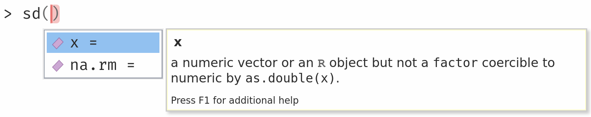
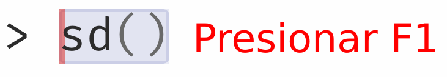

```{r setup, include=FALSE}
options(htmltools.dir.version = FALSE)
knitr::opts_chunk$set(
  fig.width=9, fig.height=3.5, fig.retina=3,
  out.width = "100%",
  cache = FALSE,
  echo = TRUE,
  message = FALSE, 
  warning = FALSE,
  hiline = TRUE
)

library(xaringanthemer)
library(magrittr)
library(metathis)
library(xaringanthemer)
library(countdown)
```

```{r xaringan-themer, include=FALSE, warning=FALSE}
style_duo_accent(
  primary_color = "#2f4871",
  secondary_color = "#2e91af",
  inverse_header_color = "#FFFFFF",
  header_color = "#106075",
  background_color = "#e9ebee",
  header_font_google = google_font("Oswald", "700", "700i"),
  text_font_google = google_font("Spartan", "400", "400i",
                                 "700", "700i"),
  code_font_google = google_font("Fira Code", "400",
                                 "700"),
  outfile = "xaringan-lis.css"
)
```

```{r xaringan-tile-view, echo=FALSE}
xaringanExtra::use_tile_view()
```

```{r broadcast, echo=FALSE}
xaringanExtra::use_broadcast()
```

```{r xaringan-scribble, echo=FALSE}
xaringanExtra::use_scribble()
```

```{r xaringan-panelset, echo=FALSE}
xaringanExtra::use_panelset()
```

```{r xaringanExtra-clipboard, echo=FALSE}
htmltools::tagList(
  xaringanExtra::use_clipboard(
    button_text = "<i class=\"fa fa-clipboard\"></i>",
    success_text = "<i class=\"fa fa-check\" style=\"color: #90BE6D\"></i>",
    error_text = "<i class=\"fa fa-times-circle\" style=\"color: #F94144\"></i>"
  ),
  rmarkdown::html_dependency_font_awesome()
)
```

```{r xaringan-logo, echo=FALSE}
xaringanExtra::use_logo(
  image_url = "img/InnovaLab_logo_blue.png",
  width = "100px",
  height = "116px"
)
```

```{r xaringan-extra-styles, echo=FALSE}
xaringanExtra::use_extra_styles(
  hover_code_line = TRUE,         
  mute_unhighlighted_code = TRUE  
)
```

```{r xaringanExtra, echo = FALSE}
xaringanExtra::use_progress_bar(color = "#0051BA",
                                location = "bottom")
```

```{r metathis, echo=FALSE}
meta() %>%
  meta_name("github-repo" = "healthinnovation/curso-introduccion-r-tidyverse") %>% 
  meta_social(
    title = "Introducción a R y Tidyverse: Sesión 02",
    description = "Curso de Introducción a R y Tidyverse: Sesión 02",
    url = "https://healthinnovation.github.io/curso-introduccion-r-tidyverse/Sesi%C3%B3n%2002/#1",
    # image = "https://healthinnovation.github.io/xaringan-innovar/img/cover-plantilla.png",
    # image_alt = "Innovar theme of R package xaringan",
    og_type = "website",
    og_author = "Laboratorio de Innovación en Salud",
    twitter_card_type = "summary_large_image",
    twitter_creator = "@innovalab_imt",
    twitter_site = "@innovalab_imt"
  )
```


<br>
<br>

# `r rmarkdown::metadata$title`

## `r rmarkdown::metadata$subtitle`

### `r rmarkdown::metadata$author`  

### `r Sys.Date()`

<br>

[`r fontawesome::fa(name = "github")` @healthinnovation](https://github.com/healthinnovation)  
[`r fontawesome::fa(name = "twitter")` @innovalab_imt](https://twitter.com/innovalab_imt)  
[`r fontawesome::fa(name = "link")` innovalab.info](https://www.innovalab.info/)  


---

## Acerca del curso

---
name: colors

## Exploración competencial

---

## ¿Qué es una función?

Las funciones son módulos de código autónomo que realizan una tarea específica y generalmente, toman algún tipo de estructura de datos (`vector`, `dataframes`, etc.), lo procesan y devuelven un resultado. 

El uso general de una función es el nombre de la función seguida de paréntesis

```{r eval=FALSE}
function_name(input)
```

Los inputs se denominan argumentos e incluyen:

- El objeto físico (cualquier estructura de datos) en el que la función lleva a cabo una tarea
- Especificaciones que alteran la forma en que opera la función

```{r echo=FALSE, out.width="75%", fig.align='center'}

```
 
---

## Buscando ayuda sobre las funciones

La mejor forma de averiguar esta información es utilizar `?` seguido del nombre de la función. Al hacer esto, se abrirá el manual de ayuda en el panel inferior derecho de RStudio que proporcionará una descripción de la función, uso, argumentos, detalles y ejemplos:

```{r eval=FALSE, include=FALSE}
helpfile <- utils:::.getHelpFile(help(sd))
outfile <- fs::file_temp(ext = ".html")
tools:::Rd2HTML(helpfile, out =outfile)
rawHTML <- paste(readLines(outfile), collapse="\n")
knitr::asis_output(htmltools::htmlPreserve(rawHTML))
```    

.pull-left[
```{r eval=FALSE}
?sd()
```

```{r eval=FALSE}
help(sd)
```

```{r echo=FALSE, out.width="55%", fig.align='left'}

```

Alternativamente, si está familiarizado con la función pero solo necesita recordar los nombres de los argumentos, puede usar:

```{r}
args(sd)
```

]

.pull-right[
```{r echo=FALSE, out.width="80%", fig.align='center'}
knitr::include_graphics("img/help_page.png")
```
]

---

## Ejemplo de una función

.line-space2-0[
Se tiene el número `3.15181930`, pero solo necesitamos dos decimales. Para ello, utilizaremos la función `round()` que redondea los números de acuerdo a la cantidad de decimales que asignemos. En este caso, solo necesitaremos 2.
]

```{r}
round(3.15181930, digits = 2)
```

.line-space2-0[
Como se puede observar, se ha utilizado el argumento `digits` para regular la cantidad de decimales. 

**Nota:** Si proporcionamos los argumentos en el mismo orden en el que han sido definidos, no es necesario nombrarlos
]

```{r}
round(3.15181930, 2)
```

---

## ¿Data.frame?

.pull-left[.line-space2-0[.font120[
- Estructura de datos 2D
- Admite datos con diferente tipo de variable (lo opuesto a matrices)
- Similar a Microsoft Excel

**Se crean con la función:**

```{r eval=FALSE}
data.frame(
  Var1 = elementos1,
  Var2 = elementos2
)
```

]]]

.pull-right[.scroll-output[
```{r}
var1 <- c("Peru", "Argentina", "Bolivia")
var2 <- rep("aceptado",3)
var3 <- seq(1000,1200,100)

df <- data.frame(var1, var2, var3)
df
```

```{r}
df <- data.frame(
  var1 = c("Peru", "Argentina", "Bolivia"),
  var2 = rep("aceptado",3),
  var3 = seq(1000,1200,100)
)
df
```
]]

---

## ¿Tibble?

.pull-left[.line-space1-5[.font120[
- Son la versión mejorada del data.frame
- Disponible en el **paquete** `tibble` y por lo tanto en el `tidyverse`.

**Se crean con la función:**

```{r eval=FALSE}
library(tibble)
tibble(
  Var1 = elementos1,
  Var2 = elementos2
)
```
]]]


.pull-right[.scroll-output[
```{r eval=FALSE}
install.packages("tibble")
```

```{r}
library(tibble)
tibble(
  var1 = c("Peru", "Argentina", "Bolivia"),
  var2 = rep("aceptado",3),
  var3 = seq(1000,1200,100)
)
```

]]


---

## data.frame() v.s. tibble()

Ambas funciones tienen sus versiones `as.*` o `as_*` que permite transformar algo en lo que se desea. En este caso se estaría usando `as.data.frame` para convertir algo a **data.frame** y `as_tibble` para ese mismo objetivo.

.pull-left[.scroll-output400[
```{r}
class(iris)
iris
```
]]

.pull-right[.scroll-output400[
```{r R.options = list(width = 40)}
as_tibble(iris)
```
]]

---

#¡Hazlo tú mismo!

.line-space2-0[.font120[
1. Crea un tibble a partir de los ganadores de las últimas copas mundiales. La estructura de la data debe contener las siguiente variables:
  - Año
  - Lugar
  - Ganador
1. Existe una base de datos integrada dentro de R que se llama `airquality`. Conviértela en un tibble, y guárdalo en otro objeto con distinto nombre.
1. Hacer lo mismo con la data `Titanic`.
]]

```{r echo=FALSE}
countdown(minutes = 8,
          margin = "1em",
          font_size = "4em",
          warn_when = 30)
```

---

## ¿Qué es un paquete?
.font120[
Los paquetes son colecciones de funciones, datos y código compilado de R en un formato bien definido, creados para agregar una funcionalidad específica.

Hay un conjunto de paquetes estándar (o base) que se consideran parte del código fuente de R y están disponibles automáticamente como parte de su instalación de R.
]
 
```{r echo=FALSE, out.width="55%", fig.align='center'}
knitr::include_graphics("img/paquetes_hexa.png")
```

---

## Instalación de paquetes desde CRAN

.line-space2-0[.font120[
La forma de instalar un paquete dependerá de dónde se encuentre. Entonces, para los paquetes disponibles públicamente, esto significa a qué repositorio pertenece. La forma más común es usar el repositorio CRAN, luego solo necesita el nombre del paquete y usa el siguiente comando:

```{r eval=FALSE}
install.packages("paquete")
```

Después de ejecutar esto, recibirá algunos mensajes en la pantalla. Dependerán del sistema operativo que esté utilizando, las dependencias y si el paquete se instaló correctamente.
]]

---

## Instalación de paquetes vía remotes

.line-space2-0[.font110[
Cada repositorio tiene su propia forma de instalar un paquete a partir de ellos, por lo que en el caso de que utilice regularmente paquetes de diferentes fuentes, este comportamiento puede ser un poco frustrante. Una forma más eficiente es probablemente usar el paquete `remotes`` para simplificar este proceso.

```{r eval=FALSE}
install.packages("remotes")
```

Después de haber instalado `remotes`` podemos utilizar algunas de sus funciones para la instalación de paquetes: 
- `remotes::install_bioc()` desde Bioconductor
- `remotes::install_github()` desde GitHub
- `remotes::install_version()` para instalar una versión específica de CRAN.
]]

---

## Base de datos a utilizar

Usaremos una base de datos proporcionado por [Gan et al. (2018)](https://www.nature.com/articles/s41598-018-27482-2) en su estudio:

```{r echo=FALSE, out.width="95%", fig.align='center', dpi=200, fig.retina=2, fig.alt="Article: Efficacy of tw o different dosages of levofloxacin in curing Helicobacter pylori infection: A Prospective, Single-Center, randomized clinical trial"}
knitr::include_graphics("img/levofloxacin_trial.png",
                        dpi = 300)
```

---

## Base de datos a utilizar

.line-space2-0[.font110[

Dicho estudio es un ensayo clínico aleatorizado (ECA) de 400 participantes en el que se compara 2 tipos de tratamientos para erradicar la infección por *Helicobácter Pylori*.

- **Grupo A** de tratamiento: Esomeprazol, amoxicilina, bismuto coloidal con pectina y levofloxacina 500mg una vez al día.
- **Grupo B** de tratamiento: Levofloxacina 200mg dos veces al día, durante un periodo de 14 días.


```{r echo=FALSE}
library(dplyr)
library(reactable)
readxl::read_excel("data/researchdata.xlsx") %>% 
  count(`Randomized group`) %>% 
  reactable(highlight = TRUE,
            striped = TRUE,
            defaultColDef = colDef(
              align = "center",
              headerStyle = list(background = "#f7f7f8",
                                 fontWeight = 700)
            ))
```
]]

---

## Importación de datos

```{r echo=FALSE}
library(htmltools)

import_archivos <- tibble(
  `Función` = c("readxl::read_excel()",
                "readr::read_csv()",
                "haven::read_dta()",
                "haven::read_sav()"),
  `Tipo de archivo` = c("excel_logo",
                        "csv_logo",
                        "stata_logo",
                        "spss_logo")
)


reactable(import_archivos,
          highlight = TRUE,
          striped = TRUE,
          defaultColDef = colDef(
            align = "center",
            minWidth = 70,
            headerStyle = list(background = "#f7f7f8",
                               fontWeight = 700)
          ),
          columns = list(
            `Función` = colDef(
              cell = function(value) {
                code(value, 
                     class = "remark-inline-code",
                     style = "position: relative;
                              top: 30%;")
              }
            ),
            `Tipo de archivo` = colDef(
              cell = function(value) {
                div(
                  img(class = "icono-archivo", 
                      alt = paste(value),
                      src = sprintf("img/%s.png", value)),
                  style = "width: 75px;
                           margin-left: 45%;"
                )
              }
            )))
```

---

## Importación de datos

Vamos a importar el archivo excel que tiene una extensión `.xlsx` y se encuentra dentro de la carpeta `data`. 

**Recuerda**: Al importar el archivo debemos asignarlo a un objeto, para poder guardar la información. En este caso llamaremos a este objeto como `trial_data`.

.scroll-output325[
```{r R.options = list(width = 90)}
trial_data <- readxl::read_excel("data/researchdata.xlsx")

trial_data
```
]
---

## Importación de datos 2

.font110[
En algunos casos estaremos frente a base de datos que contengan cierta información en sus primeras filas que no sean relevantes como datos a considerar para el análisis. La mayor cantidad de veces tienen un propósito meramente informativo. Ejemplo:

```{r echo=FALSE, out.width="95%", fig.align='center', dpi=300, fig.retina=2, fig.alt="Vista preliminar de una data que contenga las primeras filas a modo de información"}
knitr::include_graphics("img/researchdata2_preview.png",
                        dpi = 300)
```
]
---

## Importación de datos 2

.panelset[
.panel[.panel-name[Situación]
.line-space2-0[.font110[
En estas situaciones tenemos 2 alternativas:

a) Editar el archivo en cuestión y eliminar las filas que no sean relevantes.
b) Durante la importación indicar que se omitan las primeras filas o filtrarlas una vez se haya importado.

Siempre será una mejor opción manejar los cambios desde el código, ya que se esa manera mantenemos los archivos originales y además podemos tener un registro de los cambios realizados.

Para hacer esto usaremos el argumento `skip` dentro de la función `readxl::read_excel()`, que indicará la cantidad de filas que deseamos omitir en la importación.

]]
]

.panel[.panel-name[Problema]

Si intentamos importar la data sin especificar ningún argumento, veremos como se registran informaciones que no requerimos, y solo se encuentran en los datos a manera de información.

.scroll-output325[
```{r R.options = list(width = 90)}
trial_data2 <- readxl::read_excel("data/researchdata2.xlsx")

trial_data2
```
]]

.panel[.panel-name[Solución]
Ya que en este caso la base de datos llamada `researchdata2.xlsx` empieza a mostrar datos relevantes a partir de la fila 4, requeriremos omitir o saltar (`skip`) 3 filas, se la siguiente manera:

.scroll-output325[
```{r R.options = list(width = 90)}
trial_data2 <- readxl::read_excel("data/researchdata2.xlsx",
                                  skip = 3)

trial_data2
```
]

]]

---

#¡Hazlo tú mismo!

.line-space2-0[.font120[
Todas las importaciones requeridas serán asignadas en un objeto.

1. Realizar la importación del archivo excel
1. Realizar la importación del archivo csv
1. Realizar la importación del archivo spss
]]

```{r echo=FALSE}
countdown(minutes = 8,
          margin = "1em",
          font_size = "4em",
          warn_when = 30)
```

---
class: center, middle

# Retroalimentación


---
class: center, middle

<br>
<center>
<h2>
<span style="color:#106075">¡Gracias!</span>
</h2>
<br>
<h3>
`r anicon::faa('envelope', size = 'xs', animate='float', rtext='<a href="mailto:correo@gmail.com"><span style="color:#562457">&nbsp;&nbsp;correo@gmail.com</span></a>')`
</h3>
<h3>
`r anicon::faa('github', size = 'xs', animate='float', rtext='<a href="https://github.com/healthinnovation/"><span style="color:#562457">&nbsp;&nbsp; @healthinnovation</span></a>')`
</h3>
<h3>
`r anicon::faa('twitter', size = 'xs', animate='float', rtext='<a href="https://twitter.com/innovalab_imt"><span style="color:#562457">&nbsp;&nbsp; @innovalab_imt</span></a>')`
</h3>
</center>

<br>

Estas diapositivas fueron creadas mediante el paquete [xaringan](https://github.com/yihui/xaringan) y [xaringanthemer](https://github.com/gadenbuie/xaringanthemer/).

