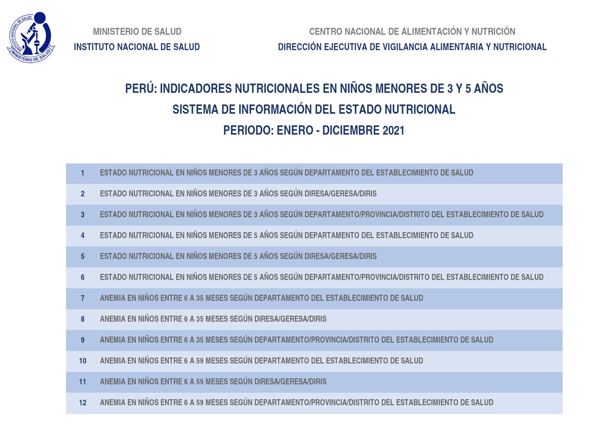

# Taller I

## Introducción

Esta fase del curso tiene por intención desarrollar un proceso de análisis de datos en base a los conceptos mostrados y explicados en las 3 primeras sesiones. Mediante una serie de instrucciones y la posibilidad de consultar pistas/ayudas referenciadas, se busca que el estudiante pueda aplicar conceptos y desarrolle las habilidades procedimentales para lograr dar solución a los problemas planteados.

## Instrucciones

En este proyecto usaremos la información dispuesta en la página de [Vigilancia Del Sistema De Información Del Estado Nutricional en EESS](https://web.ins.gob.pe/es/alimentacion-y-nutricion/vigilancia-alimentaria-y-nutricional/vigilancia-del-sistema-de-informacion-del-estado-nutricional-en-%20EESS) del Instituto Nacional de Salud (INS). Específicamente trataremos con la base de datos de estado nutricional de niños menores de 5 años en el **Periodo: Enero-Diciembre 2021**.

1. Descargar la base de datos en mención del siguiente enlace y posicionarlo en un nuevo proyecto Rstudio con sus carpetas respectivas: https://web.ins.gob.pe/sites/default/files/Archivos/cenan/van/informes/2021/1.Indic%20Ni%C3%B1os%20a%20Diciembre%202021%20-%20PERU.xlsx
2. La base de datos contiene información variada acerca de niveles de anemia y estado nutricional de niños desde los 6 meses de edad hasta los 5 años a nivel departamental, provincial y distrital. Para estos ejercicios vamos a requerir **importar únicamente** la información de los *niveles de anemia en niños de 6 a 35 meses* que accedieron a los establecimientos de salud, según el departamento.

  
Ayuda 1

  
Esta data se encuentra en la hoja (sheet) **Anemia 6-35m x DEP**

  
Ayuda 2

  
Para importar una hoja de excel en específico se puede usar el argumento `sheet` dentro de la función `read_excel` del paquete `readxl`.

  
Ayuda 3

  
Para omitir la lectura de filas iniciales que podrían no contener información relevante, revisa el argumento `skip` de la función `read_excel`.

  
Ayuda 4

  
Si se tiene una fila que no forma parte de los valores de los datos que persiste a pesar de usar el argumento `skip`, se puede retirar mediante el uso de la función `slice()`. Recordar que si se usa el signo `-` dentro de esa función se está dando la indicación de **retirar** la fila en lugar de seleccionarla.

3. Hacer un reconocimiento de variables y determinar si alguna de estas requiere aplicarse algún formato. Por ejemplo, pasar de una columna `character` a `numeric`.

  
Ayuda 1

  
Para el reconocimiento de variables se puede usar la función `glimpse()`

  
Ayuda 2

  
El formateo de los datos se puede hacer con la función `mutate()`. Además existen 2 funciones bases que podrían ser útiles (alguna de ellas): `as.character()` y `as.numeric()`.

4. La columna que contiene la información de los departamentos tiene todos sus registros en mayúsculas. Será necesario tener esos registros en formato **Sentence case**, es decir que las letras con el que empiecen las palabras sean en mayúsculas y el resto en minúsculas. Por ej. “AMAZONAS” a “Amazonas”, “PIURA” a “Piura”, “LIMA” a “Lima”, etc.

  
Ayuda 1

  
Las funciones `mutate()` y `str_to_sentence()` serán útiles para completar esta petición.

5. **Identificar** los departamentos y su pertenencia a la región geográfica correspondiente (costa, sierra y selva). Tener en cuenta:
  - Costa: Callao, Ica, La Libertad, Lambayeque, Lima, Piura, Tacna, Tumbes.
  - Sierra: Ancash, Apurímac, Arequipa, Ayacucho, Cajamarca, Cusco, Huancavelica, Huánuco, Junín, Moquegua, Pasco, Puno.
  - Selva: Amazonas, Loreto, Madre de Dios, San Martín, Ucayali.

  
Ayuda 1

  
Para clasificar una variable existente, revisar: `mutate()` y `case_when()`.

6. Sobre la clasificación anterior, mostrar lo siguiente:
  - Mostrar los 5 departamentos con mayor cantidad de casos por Anemia Total.
  - Número de departamentos que reportan casos de anemia por región geográfica.
  - Ordenar de forma descendente la tabla anterior generada.

  
Ayuda 1

  
La función `slice_max()` es útil para seleccionar los casos más frecuentes en base a otra (cantidad, por ej.)

  
Ayuda 2

  
La función `count()` es útil para generar tablas de frecuencias y contabilizar casos.

  
Ayuda 3

  
Revisar: Uso de `arrange()` y `desc()`.

7. Por último, es necesario transformar la base de datos de tal manera que los tipos de anemia se encuentren en una sola columna y la cantidad de ellos se encuentren en diferentes filas/observaciones. 

  
Ayuda 1

  
La función `pivot_longer()` puede agrupar varias columnas en una sola.

¡Éxtitos en el taller!

**Ver solución [aquí](taller1_solved.html)**
