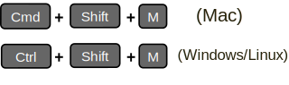

```{r setup, include=FALSE}
options(htmltools.dir.version = FALSE)
knitr::opts_chunk$set(
  fig.width=9, fig.height=3.5, fig.retina=3,
  out.width = "100%",
  cache = FALSE,
  echo = TRUE,
  message = FALSE, 
  warning = FALSE,
  hiline = TRUE
)

library(xaringanthemer)
library(magrittr)
library(metathis)
library(countdown)
library(flair)
library(flipbookr)
```

```{r xaringan-themer, include=FALSE, warning=FALSE}
style_duo_accent(
  primary_color = "#2f4871",
  secondary_color = "#2e91af",
  inverse_header_color = "#FFFFFF",
  header_color = "#106075",
  background_color = "#e9ebee",
  header_font_google = google_font("Oswald", "700", "700i"),
  text_font_google = google_font("Spartan", "400", "400i",
                                 "700", "700i"),
  code_font_google = google_font("Fira Code", "400",
                                 "700"),
  outfile = "xaringan-lis.css"
)
```

```{r xaringan-tile-view, echo=FALSE}
xaringanExtra::use_tile_view()
```

```{r broadcast, echo=FALSE}
xaringanExtra::use_broadcast()
```

```{r xaringan-scribble, echo=FALSE}
xaringanExtra::use_scribble()
```

```{r xaringan-panelset, echo=FALSE}
xaringanExtra::use_panelset()
```

```{r xaringanExtra-clipboard, echo=FALSE}
htmltools::tagList(
  xaringanExtra::use_clipboard(
    button_text = "<i class=\"fa fa-clipboard\"></i>",
    success_text = "<i class=\"fa fa-check\" style=\"color: #90BE6D\"></i>",
    error_text = "<i class=\"fa fa-times-circle\" style=\"color: #F94144\"></i>"
  ),
  rmarkdown::html_dependency_font_awesome()
)
```

```{r xaringan-logo, echo=FALSE}
xaringanExtra::use_logo(
  image_url = "img/InnovaLab_logo_blue.png",
  width = "100px",
  height = "116px"
)
```

```{r xaringan-extra-styles, echo=FALSE}
xaringanExtra::use_extra_styles(
  hover_code_line = TRUE,         
  mute_unhighlighted_code = TRUE  
)
```

```{r xaringanExtra, echo = FALSE}
xaringanExtra::use_progress_bar(color = "#0051BA",
                                location = "bottom")
```

```{r metathis, echo=FALSE}
meta() %>%
  meta_name("github-repo" = "healthinnovation/curso-introduccion-r-tidyverse") %>% 
  meta_social(
    title = "Introducción a R y Tidyverse: Sesión 03",
    description = "Curso de Introducción a R y Tidyverse: Sesión 03",
    url = "https://healthinnovation.github.io/curso-introduccion-r-tidyverse/sesion_03/#1",
    image = "https://healthinnovation.github.io/xaringan-innovar/img/cover-sesion03.png",
    image_alt = "Cover de la Sesión 03 del curso de Introducción a R y Tidyverse",
    og_type = "website",
    og_author = "Laboratorio de Innovación en Salud",
    twitter_card_type = "summary_large_image",
    twitter_creator = "@innovalab_imt",
    twitter_site = "@innovalab_imt"
  )
```


<br>
<br>

# `r rmarkdown::metadata$title`

## `r rmarkdown::metadata$subtitle`

### `r rmarkdown::metadata$author`  

### `r Sys.Date()`

<br>

[`r fontawesome::fa(name = "github")` @healthinnovation](https://github.com/healthinnovation)  
[`r fontawesome::fa(name = "twitter")` @innovalab_imt](https://twitter.com/innovalab_imt)  
[`r fontawesome::fa(name = "link")` innovalab.info](https://www.innovalab.info/)  


---
## Contenidos

.line-space3-0[.font120[
- Reconocimiento de variables (función glimpse)
- Anidación de funciones con pipe (%>%)
- Cálculo de variables (introducción a mutate)
- Contabilización y ordenamiento en base a variables (uso de count y arrange).
- Explicación de tidy data 
- Modificación a la estructura de los datos mediante pivot longer y wider 
]]

---
class: center, middle, inverse

# Exploración competencial

---

## Función Glimpse 

.panelset[
.panel[.panel-name[¿Para qué sirve?]
.pull-left[.line-space2-0[.font120[
- Versión transpuesta de print
- Ayuda a visualizar la mayor cantidad de datos de muchas columnas.
- Muestra el nombre de la variable junto con una designación de tipo de variable.
]]]

.pull-right[
<br>
<span style="background-color: #eeff41;
             padding: 20px 250px 15px 10px">**Mediante la función:**</span>

```{r eval=FALSE}
glimpse()
```

**Recordar importar el paquete `tidyverse`**
.scroll-output200[
```{r message=TRUE}
library(tidyverse)
```
]]]

.panel[.panel-name[Ejemplo]

.pull-left[
Así habitualmente observamos la data:
.scroll-output350[
```{r R.options = list(width = 50)}
nycflights13::flights
```
]]

.pull-right[
Con `glimpse()`, podrías tener un vistazo rápido de la estructura de los datos:

.scroll-output325[
```{r}
glimpse(nycflights13::flights)
```
]]]

.panel[.panel-name[Glimpse]

Generalmente la vista de `glimpse()` es suficientemente ordenada para poder observar la estructura de la data sin problemas. Pero también se puede usar el argumento `width` para poder especificar ello.

.scroll-output325[
```{r}
glimpse(nycflights13::flights, width = 90)
```
]]]

---

## Operador Pipe `%>%`

.pull-left[
**Queremos aplicar más de una función:**
El uso de funciones de forma anidada puede resultar ilegible o difícil de comprender.

```{r eval=FALSE}
tabla(formato(coeficiente(data)))
```

El operador `%>%` nos permite escribir una secuencia de operaciones de izquierda a derecha:

```{r eval=FALSE}
coeficiente(data) %>% formato() %>% tabla()
```

**O mejor aún:**

```{r eval=FALSE}
coeficiente(data) %>% 
  formato() %>% 
  tabla()
```
]

.pull-right[.font120[
<br>
Útil para concatenar múltiples operaciones en dplyr 

<br>
<span style="background-color: #eeff41;
             padding: 20px 250px 15px 10px">**Atajo de Teclado**</span>

<br>

```{r echo=FALSE}

```
]]


---

## Función `mutate()`


.pull-left[.line-space2-0[.font110[ 
Con `mutate()` podemos realizar modificaciones en las variables.  Por ej. sumar variables, o modificarlas de alguna manera (transformar a porcentaje, multiplicarlas por alguna constante, etc.). Estas modificaciones pueden realizarse:

- Creando una nueva variable a partir de otras ya existentes.
- Modificar una variable existente en la misma variable.

]]]

.pull-right[.font110[
<span style="background-color: #eeff41;
             padding: 20px 250px 15px 10px">**Ejemplo:**</span>

```{r eval=FALSE}
library(tidyverse)

df %>% 
  mutate(
    New_var = var*2
  )
```

**Explicación:**

En una data llamada `df` se estaría aplicando la función `mutate` creando una variable llamada `New_var` a partir de otra variable llamada `var` que está siendo multiplicada por 2.

]]

---
## Uso práctico de `mutate()`


.panelset[
.panel[.panel-name[Reconocimiento de BD]

Para esta ejemplificación usaremos la base de datos del ECA  sobre la [erradicación de la infección por *Helicobácter Pylori*](https://www.nature.com/articles/s41598-018-27482-2) explicado en la [sesión 02](https://healthinnovation.github.io/curso-introduccion-r-tidyverse/sesion_02/#14).

.pull-left[
.scroll-output350[
```{r R.options = list(width = 45)}
trial_data <- readxl::read_excel("data/researchdata.xlsx")
trial_data
```
]]

.pull-right[
.scroll-output350[
```{r R.options = list(width = 70)}
glimpse(trial_data)
```
]]
]

.panel[.panel-name[Janitor]

En algunas ocasiones las base de datos contienen nombres de variables muy largas o que incluso pueden contener espacios o símbolos. Una forma sencilla de solucionar ello es mediante el uso de la función `clean_names()` del paquete `janitor`.

.scroll-output300[
```{r R.options = list(width = 90)}
trial_data <- trial_data %>% 
  janitor::clean_names() 
trial_data
```
]]

.panel[.panel-name[Rename]

A pesar de que `janitor::clean_names()` nos proporciona una gran solución para el formateo de nombres de variables que tienen espacios y/o símbolos, a veces podría ser necesario modificar específicamente el nombre de algunas variables. Para ello usaremos la función `rename` de la siguiente manera:

.scroll-output300[
```{r R.options = list(width = 90), highlight.output=2}
trial_data <- trial_data %>% 
  rename(
    follow_4_weeks = follow_up13c_ubt_4_weeks_after_therapy #<<
  )
trial_data
```
]]

.panel[.panel-name[Mutate I]

.pull-left[.line-space2-0[
Una de las primeras cosas que podemos hacer con `mutate` durante el primer contacto con la data que trabajemos es:

- Configurar variables `ID` como **texto** (`character`).
- Configurar variables como **factores**.
- Configurar respuestas `NA` en caso tengan alguna otra codificación.
]]

.pull-right[
1. Configurar la variable `ID`

.scroll-output325[.code80[
```{r R.options = list(width = 45)}
trial_data %>% 
  mutate(
    patient_number = as.character(patient_number)
  )
```
]]
]]

.panel[.panel-name[Mutate II]
.pull-left[
<ol start="2">
  <li>Configurar <strong>factores</strong></li>
</ol>

.scroll-output325[.code80[
```{r R.options = list(width = 45), highlight.output=c(15,20)}
trial_data %>% 
  mutate(
    randomized_group = factor(randomized_group), #<<
    complete_the_study = factor(complete_the_study) #<<
  )
```
]]
]

.pull-right[
<ol start="3">
  <li>Configurar respuestas <code>NA</code></li>
</ol>

Para reemplazar respuestas dependiendo de una condición en particular se puede utilizar la función `case_when()` dentro de un `mutate()`

.code80[
```{r eval=FALSE}
trial_data %>% 
  mutate(
    Var = case_when(
      Var == "Text" ~ "New_Text", 
      TRUE ~ Var
    )
  )
```
]
De esta manera en la variable `Var` se reemplazará todos los casos que registren el dato de **Text** por **New_Text**. 
]

]]

---

## Uso de `count`

.line-space1-5[
La función `count` es bastante sencilla y poderosa a la vez. Permite obtener una tabla en formato `tibble` que representará las frecuencias (cantidades `n`) de una o múltiples variables en específico.
]

```{r}
trial_data %>% 
  count(adverse_drug_reactions)
```

.line-space1-5[
La tabla generada muestra que cantidad de personas han tenido reacciones adversas a los medicamentos ya sea en el Grupo A o B. Sin embargo, también se aprecia que hay 2 respuestas que indican la presencia de datos vacíos: **NA** y **&lt;NA&gt;**. El primero está codificado directamente como texto (`character`) y sel segudo es un `NA` real, es decir que comunica la ausencia de un dato.
]

---
## Uso de `mutate()` y `case_when()`

.panelset[
.panel[.panel-name[Explicación previa del NA]
.line-space1-5[
Al importar las bases de datos dentro de R, la gran mayoría de funciones (como `read_excel()`) interpretarán los valors en blanco o celdas vacías como reales `NA`. Sin embargo si en las celdas se ha llenado explícitamente el texto **NA** o se ha usado alguna codificación diferente, el valor de `NA` no se introducirá automáticamente y habrá que indicarlo como tal (`case_when()`).
]

.pull-left[
```{r echo=FALSE, out.width="90%", fig.align='center', dpi=200, fig.retina=2}
knitr::include_graphics("img/view_excel_na.png",
                        dpi = 300)
```
]

.pull-right[
```{r highlight.output=c(4,7)}
trial_data %>% 
  count(adverse_drug_reactions)
```
]]

.panel[.panel-name[Uso de case_when()]

La función `case_when()` tiene una aplicación directa y perfecta para estos fines, en el que recodificaremos el **NA** introducido como texto a un `NA` real que sea reconocido como tal. El mismo procedimiento se utilizaría si los valores faltantes o perdidos se hubieran codificado de otra forma (ej. `777` o `999`).

.pull-left[
Recordar que con **pipe** (` %>% `) podemos anidar muchas funciones en un solo bloque:

```{r eval=FALSE}
trial_data %>%
  mutate(
    adverse_drug_reactions = case_when(
      adverse_drug_reactions == "NA" ~ NA_character_, #<<
      TRUE ~ adverse_drug_reactions
    )
  ) %>% 
  count()
```
]

.pull-right[

El código `TRUE ~ adverse_drug_reactions` significa que **todos los demás casos** mantendrán el valor original que el de la variable.

```{r echo=FALSE, highlight.output=6}
trial_data %>%
  mutate(
    adverse_drug_reactions = case_when(
      adverse_drug_reactions == "NA" ~ NA_character_,
      TRUE ~ adverse_drug_reactions
    )
  ) %>% 
  count(adverse_drug_reactions)
```
]]

.panel[.panel-name[Advertencia]

La función `case_when` requiere respetar de forma estricta el tipo de vector utilizado. Es decir que si se le pide recodificar una variable a número, y dentro de esa variable continúan habiendo textos, habrá un problema de **no-coerción**. Es por ese motivo que en el anterior ejemplo se usa `NA_character` en vez de únicamente `NA`, ya que este elemento como tal en realidad es de tipo lógico.

```{r}
typeof(NA)
typeof(NA_character_)
typeof(NA_real_)
```

]]

---
## Más sobre `case_when()`

Anteriormente vimos como usar la función `case_when` para recategorizar/recodificar variables en base a una condición de igualdad (`==`). Sin embargo, no es la única manera. También se puede recategorizar en base a múltiples condiciones, como `%in%` (comparar con múltiples valores a la vez), `>`, `>=`, `<` y `<=`, en conjunto con `&` y `|`.

.pull-left[

Para ejemplificar esto haremos una recategorización de la base `nycflights13::flights`:

.scroll-output225[
```{r}
nycflights13::flights %>% 
  count(year, month)
```
]]

.pull-right[
Consideraremos del mes 1 hasta el 6 como **2013-I** y a partir del mes 7, como **2013-II**. 

.scroll-output250[
```{r}
nycflights13::flights %>% 
  mutate(
    year = case_when(
      month %in% 1:6 ~ "2013-I",
      TRUE ~ "2013-II"
    )
  ) %>% 
  count(year)
```
]]

---
## Más sobre `case_when()`

Ya que la variable `month` es de tipo `integer` (**numérica**) tenemos más formas alternativas de conseguir exactamente el mismo resultado mostrado anteriormente.

.pull-left[

En variables numéricas, podemos directamente usar `<=` en las condiciones.

```{r}
nycflights13::flights %>% 
  mutate(
    year = case_when(
      month <= 6 ~ "2013-I",
      month > 6 ~ "2013-II"
    )
  ) %>% 
  count(year) 
```
]

.pull-right[

O directamente usar `TRUE ~ "Condicion`, para *todos los demás casos*.

```{r}
nycflights13::flights %>% 
  mutate(
    year = case_when(
      month <= 6 ~ "2013-I",
      TRUE ~ "2013-II"
    )
  ) %>% 
  count(year) 
```
]

---
## Más usos de `count()` y `arrange()`

.panelset[
.panel[.panel-name[Intro]

Ya hemos visto que `count()` es sumamente útil. Además, basta con agregar más variables dentro de sus argumentos, para que estos automáticamente ingresen a generar una tabla de frecuencias. Sin embargo, a veces puede ser necesario ordenar esos resultados, para ello usaremos `arrange()`.

.pull-left[
```{r}
trial_data <- trial_data %>% 
  mutate(
    follow_4_weeks = case_when(
      follow_4_weeks == "NA" ~ NA_character_,
      TRUE ~ follow_4_weeks
    ),
    adverse_drug_reactions = case_when(
      adverse_drug_reactions == "NA" ~ NA_character_,
      TRUE ~ adverse_drug_reactions
    )
  )
```
]

.pull-right[
.scroll-output300[
```{r}
trial_data %>% 
  count(randomized_group, 
        follow_4_weeks,
        adverse_drug_reactions)
```
]]
]

.panel[.panel-name[arrange()]

La función `arrange()` permitirá ordenar un objeto en base a una o múltiples variables. En caso se ejecute sobre una variable numérica, se ordenará de menor a mayor por defecto, y en caso se ejecute sobre una variable texto (`character`) se ordenará de forma alfabética, tal y como ya lo hace `count()` por defecto.


.pull-left[
Si se desea invertir el ordenamiento, se puede utilizar la función `desc()` dentro de `arrange()`.

```{r, echo=FALSE}
decorate_chunk("count_arrange_1", eval = FALSE) %>% 
  flair("desc(follow_4_weeks)") %>% 
  flair("desc", color = "red")
```
]

.pull-right[
.scroll-output275[
```{r count_arrange_1, echo=FALSE}
trial_data %>% 
  count(randomized_group, 
        follow_4_weeks,
        adverse_drug_reactions) %>% 
  arrange(randomized_group, 
          desc(follow_4_weeks)) 
```
]]
]]

---

```{r, echo=FALSE}
description_slice_max <- ".line-space1-7[.font110[Anteriormente conocido como `top_n()`, la función `slice_max()`, permite seleccionar cuantos casos (filas) se específique en base a una variable numérica.]]"
```

`r chunk_reveal("slice_max_1", break_type = "user", title = paste0("## Uso de slice_max() \n", description_slice_max), chunk_options = "R.options = list(width = 60)")`

```{r slice_max_1, include = FALSE}
trial_data %>% #BREAK
  count(randomized_group,
        follow_4_weeks) %>% #BREAK
  slice_max(order_by = n,
            n = 2) #BREAK
```

```{css, echo=FALSE}
.panel2-slice_max_1-user {
    height: 380px;
    overflow-y: auto !important;
}
```

---
## ¡Hazlo tú mismo!

.line-space2-0[.font120[
1. Generar una tabla de frecuencias para conocer cuantos de los que completaron el estudio, presentaron reacciones adversas al tratamiento
2. Complementar la tabla del anterior punto agregando la variable del grupo de tratamiento al que pertenece.
]]

```{r echo=FALSE}
countdown(minutes = 8,
          margin = "1em",
          font_size = "4em",
          warn_when = 30)
```
---
## Introducción a tidydata 

.font80[
```{r echo=FALSE, out.width="75%", fig.align='center', dpi=200, fig.retina=2, fig.alt="Tidy data for Efficiency, Reproducibility, and Collaboration", fig.cap="Julie Lowndes y Allison Horst, 2020, Tidy data for Efficiency, Reproducibility, and Collaboration"}
knitr::include_graphics("img/tidydata_7.jpg",
                        dpi = 300)
```
]

---
## Introducción a tidydata 

.left-column[.line-space1-5[
Tener datos ordenados (**tidydata**) significa tener una BD con estructuras adecuadas, donde cada registro representa una fila, cada variable representa una columna y cada celda contiene una simple medida ([**Hadley Wickham,2014**](https://www.jstatsoft.org/article/view/v059i10)).
]]

.right-column[
.font80[
```{r echo=FALSE, out.width="95%", fig.align='center', dpi=200, fig.retina=2, fig.alt="En tidydata, cada variable es una columna; cada observación, una fila; y cada celda es una medición única.", fig.cap="Julie Lowndes y Allison Horst, 2020, Tidy data for Efficiency, Reproducibility, and Collaboration"}
knitr::include_graphics("img/tidydata_1.jpg",
                        dpi = 300)
```
]]

---
## Uso de pivot_longer() y pivot_wider()

.panelset[
.panel[.panel-name[Intro]

.left-column[.line-space1-5[
Para este ejemplo usaremos una base de datos que contiene casos de personas fallecidas a causa del coranovirus a nivel de país, este dataset está alojada en el siguiente repositorio de GitHub ([click aquí](https://github.com/CSSEGISandData/COVID-19)).
]]

.right-column[.font80[
```{r echo=FALSE, out.width="95%", fig.align='center', dpi=200, fig.retina=2, fig.alt="Repositorio github de personas fallecidas por Coronavirus a nivel global", fig.cap="Personas fallecidas por Coronavirus a nivel global"}
knitr::include_graphics("img/github_covid_1.png",
                        dpi = 300)
```
]]
]

.panel[.panel-name[Importación]

La función `read_csv` del paquete `readr` (se carga automáticamente cuando se realiza `library(tidyverse)`), permite importar archivos `csv` (data) incluso cuando el archivo está en una web.

.scroll-output300[
```{r echo=TRUE, message=FALSE, warning=FALSE, R.options = list(width = 90)}
covid19 <- read_csv("https://raw.githubusercontent.com/CSSEGISandData/COVID-19/master/csse_covid_19_data/csse_covid_19_time_series/time_series_covid19_deaths_global.csv")
covid19
```
]]

.panel[.panel-name[¿Pivot?]

.pull-left[.font80[
```{r echo=FALSE, out.width="75%", fig.align='center', dpi=200, fig.retina=2, fig.alt="Infografía de pivot realizado por Dr. Peter D.R. Higgins", fig.cap="Infografía de pivot realizado por Dr. Peter D.R. Higgins"}
knitr::include_graphics("img/pivot_longer_wider.png",
                        dpi = 300)
```

]]

.pull-right[.line-space1-5[.font110[
Tenemos un conjunto de datos donde cada una de las fechas de fallecimiento por **Covid-19** se encuentran almacenadas como columnas. 

Sin embargo, esta forma de organizar la información podría generar dificultades al momento de pre-procesar la información o realizar algún tipo de análisis. Tener todas las fechas y casos de muerte por COVID-19 en 2 columnas (`fecha` y `fallecidos`), podría ayudar a este proceso. 
]]]
]

.panel[.panel-name[Pivotear]

.left-column[.line-space2-2[.font110[
Así, dependiendo de el formato inicial de los datos, tendremos que **pivotear** hacia la derecha (`wider`) o hacia abajo (`longer`).
]]]

.right-column[

.pull-left[.font80[
```{r echo=FALSE, out.width="85%", fig.align='center', dpi=200, fig.retina=2, fig.alt="Animación del uso de pivot_longer y pivot_wider", fig.cap="Transformación de datos, 2021, Data Analytics Coding Fundamentals"}
knitr::include_graphics("img/tidyr-pivot_wider_longer.gif",
                        dpi = 300)
```
]]

.pull-right[
<br>
<br>
```{r echo=FALSE, out.width="100%", fig.align='center', dpi=300, fig.retina=2, fig.alt="Gif sobre Ross en la serie Friends diciendo Pivot Pivot Pivot, para intentar subir su sillón nuevo a su nuevo departamento"}
knitr::include_graphics("img/ross-pivot-friends.gif",
                        dpi = 300)
```
]]]
]

---

```{r, echo=FALSE}
description_pivot_longer <- ".line-space1-7[.font110[La función `pivot_longer` permitirá pasar todas las fechas que están a lo largo de las columnas a 2: `fecha` y `fallecidos`.]]"
```

`r chunk_reveal("pivot_longer_1", break_type = "user", title = paste0("## Uso de pivot_longer() \n", description_pivot_longer), chunk_options = "R.options = list(width = 55)")`

```{r pivot_longer_1, include = FALSE}
covid19 %>% #BREAK
  select(-c(Lat:Long)) %>% #BREAK
  pivot_longer(
    cols = -c(`Province/State`:`Country/Region`),
    names_to = "fecha",
    values_to = "fallecidos"
  ) #BREAK
```

```{css, echo=FALSE}
.panel2-pivot_longer_1-user {
    height: 380px;
    overflow-y: auto !important;
}
```

---
```{r include=FALSE}
covid19_tidy <- covid19 %>% 
  select(-c(Lat:Long)) %>% 
  pivot_longer(
    cols = -c(`Province/State`:`Country/Region`),
    names_to = "fecha",
    values_to = "fallecidos"
  ) 
```

```{r, echo=FALSE}
description_pivot_wider <- ".line-space1-7[.font110[De forma análoga, la función `pivot_wider()` hará exactamente lo contrario, pasar de una data que se encuentre ordenada (**tidy data**), a una data ancha. Para esta función se tendrá que indicar los argumentos: `names_from` y `values_from`.]]"
```

`r chunk_reveal("pivot_wider_1", break_type = "user", title = paste0("## Uso de pivot_wider() \n", description_pivot_wider), chunk_options = "R.options = list(width = 55)")`


```{r pivot_wider_1, include = FALSE}
covid19_tidy %>% #BREAK
  pivot_wider(
    names_from = "fecha",
    values_from = "fallecidos"
  ) #BREAK
```

```{css, echo=FALSE}
.panel2-pivot_wider_1-user {
    height: 340px;
    overflow-y: auto !important;
}
```

---
## ¡Hazlo tú mismo!

.line-space2-0[.font120[
1. Replica los procedimientos observados en las diapositivas
1. Genera un objeto tidy (`pivot_longer`)
1. Genera un objeto wider (`pivot_wider`)
]]

```{r echo=FALSE}
countdown(minutes = 8,
          margin = "1em",
          font_size = "4em",
          warn_when = 30)
```

---
class: center, middle

# Retroalimentación


---
class: center, middle

<br>
<center>
<h2>
<span style="color:#106075">¡Gracias!</span>
</h2>
<br>
<h3>
`r anicon::faa('envelope', size = 'xs', animate='float', rtext='<a href="mailto:correo@gmail.com"><span style="color:#562457">&nbsp;&nbsp;correo@gmail.com</span></a>')`
</h3>
<h3>
`r anicon::faa('github', size = 'xs', animate='float', rtext='<a href="https://github.com/healthinnovation/"><span style="color:#562457">&nbsp;&nbsp; @healthinnovation</span></a>')`
</h3>
<h3>
`r anicon::faa('twitter', size = 'xs', animate='float', rtext='<a href="https://twitter.com/innovalab_imt"><span style="color:#562457">&nbsp;&nbsp; @innovalab_imt</span></a>')`
</h3>
</center>

<br>

Estas diapositivas fueron creadas mediante el paquete [xaringan](https://github.com/yihui/xaringan) y [xaringanthemer](https://github.com/gadenbuie/xaringanthemer/).
